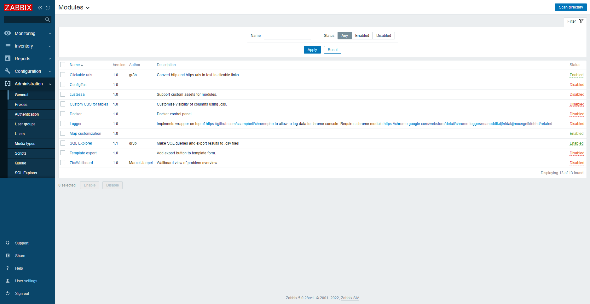

## Clickable urls

Module converts text starting with `http://` or `https://` to clickable links. Links will be opened in new tab, referrer passing is disabled.
Only text inside table cells is converted to urls.

### Compatibility and Zabbix support

Module is designed to work with Zabbix 5.0 and newer.

### Installation

Download latest release, unzip and activate in modules UI.
